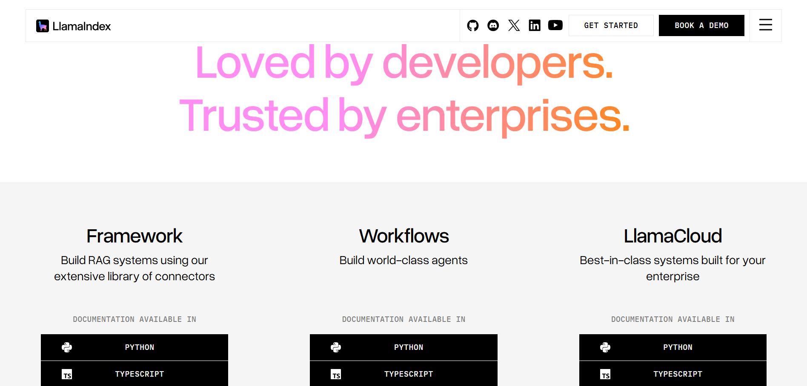

.png)

[LangChain](https://www.langchain.com/) is an open-source framework that makes building AI applications easy, allowing developers connect various data sources and components with Large Language Models (LLM).

With LangChain, you don’t have to write boilerplate code to build AI agents or applications, and you also don't have to reinvent the wheel.

LangChain has been used for a while, and it’s the most popular framework for building AI applications with features such as memory, agents, LLM orchestration, tools, and so on.

But developers are looking for alternatives due to some drawbacks:

-   **Complexity:** It’s easy to use LangChain for basic applications or prototypes, but when it comes to production-level applications, it becomes complex to handle due to its vast number of classes and functions.
-   **Performance Issues:** Due to sequential API calls within the framework, LangChain sometimes experiences performance issues in terms of latency and limited async support in some areas, making it a challenge to use in production-grade applications. Though [LangGraph](https://www.langchain.com/langgraph) aims to improve agent orchestration in some of these areas.
-   **Overhead for Simple Use Cases:** If you are trying to build a simple AI application, LangChain might be overkill; a simpler alternative is better suited.
-   B**etter Control/Modularity**: A lot of developers find its abstractions hard to understand, making it difficult to tweak when things break.

In this article, you will explore several LangChain tools and their key features. You’ll also learn about their advantages and limitations, which will help you identify the option that best fits your specific use case. Finally, a side-by-side comparison of these tools will highlight their differences and practical applications.

## What to Look for in a LangChain Alternative

When looking for a LangChain alternative, there are certain criteria you should keep in mind:

-   **Ease of Integration:** Ensure the framework is easy to integrate various APIs, data sources, and LLMs. This makes it easier to add AI components into existing applications.
-   **Supported Languages:** LangChain supports JavaScript and Python, so if you are moving to another alternative, ensure it supports multiple languages and is not restricted to just a single language.
-   **Tooling and Agent Support:** While building AI applications, you need tools and agents; tools allow your framework to interact with external APIs, while agents allow you to build AI applications that can reason on their own. While LangChain already has these, other frameworks offer better improvements on existing LangChain capabilities.
-   **Memory/Retrieval capabilities (RAG):** Memory and retrieval capabilities allow AI applications to learn, adapt, and maintain context over time. An AI framework should have functions that allow you to implement these.
-   **Scalability:** The AI framework should handle growing demands and more data without facing any difficulty. And also make it easy to integrate more resources without facing any difficulties.
-   **Enterprise Readiness:** If you are switching to an alternative from LangChain, then you want to make sure that the framework you want to use meets all enterprise standards in terms of security, scalability, support, and integration.
-   **Community & Support:** The documentation of the AI framework is regularly updated, and has an active community both online and offline to always catch up with recent trends in the industry.
-   **Performance:** Performance also matters, especially scaling; you want an AI framework that would be fast regardless of the amount of resources mounted on it.
-   **Cost and Licensing:** Just like LangChain, it should be open source and free to use, either for personal or commercial use cases.

## Top 10 LangChain Alternatives

Here is a list of the top 10 LangChain alternatives out there.

### 1. LlamaIndex

[LlamaIndex](https://www.llamaindex.ai/) is a powerful LangChain alternative, with a focus on document understanding and data retrieval. This implies that LlamaIndex is best used to build AI applications that need to connect to a data source.

You can integrate LlamaIndex with any data source, whether it’s an image, document, tabular data, multimedia, PDFs, or so on, regardless of the size. It’s suited for those who are interested in building RAG pipelines effortlessly. It supports both Python and JavaScript, making it versatile for various applications.

LlamaIndex is best suited when you are building knowledge bases, research assistants, and chatbots. In general, AI applications rely on a data source.

**Key Features**

-   **Document Loaders:** LlamaIndex allows you to ingest raw data into various forms that LLMs and LlamaIndex can understand. These raw data are usually unstructured data like PDFs, plain text files, database rows, or data from APIs.
-   **Vector Indexing:** With LlamaIndex, you can create a machine-readable representation of your data, which is called a Vector Index, using embeddings and vector databases.
-   **Query Engines:** LlamaIndex provides functions that make it easy for you to query your data. When a user’s query is submitted, it searches the index using a vector search to return the answer to the user’s question.
-   **Agents:** With LlamaIndex, you can create powerful AI agents that are powerful and capable of reasoning, planning, and using external tools to execute complex tasks.

**Limitations**

-   LlamaIndex is focused on document retrieval, making it less focused on various agentic workflows compared to LangChain.
-   Also, it has fewer tools and utilities compared to LangChain.

### 2. Semantic Kernel

Unlike LangChain, which allows building of AI applications based on modular integration, [Semantic Kernel](https://learn.microsoft.com/en-us/semantic-kernel/overview/) is more of a software development kit that allows you to integrate already existing programming logic with LLMs. Think of Semantic Kernel as an orchestration SDK that you can plug into your business logic.

Semantic Kernel is focused mainly on C#, Python, and Java, and doesn’t support JavaScript like LangChain. Since Semantic Kernel was developed by Microsoft, it natively integrates with OpenAI, Azure, and HuggingFace.

Semantic Kernel is suitable for businesses, especially enterprise who don’t want to rewrite their existing codebase around an AI framework, but prefer a framework they can just plug into their workflow.

**Key Features**

-   **Skills:** Skills in Semantic Kernel are like reusable building blocks you can plug into various workflows.
-   **Memory:** Just like LangChain, you can use the Semantic Kernel feature to build AI applications that hold information persistently, allowing them remember context from various interactions.
-   **Connectors:** Semantic Kernel allows you to link your AI models to external systems, databases, or services, ensuring that the right data flows through.
-   **Planners:** These are intelligent agents that allow you to orchestrate various elements to achieve a complex user goal, automatically determining the best sequence of tools to use.

**Limitations**

-   Semantic Kernel has a steep learning curve, and evolving APIs requiring frequent code updates.
-   There are feature gaps between .NET, Python, and Java SDKs.
-   Less suited for complex agent collaboration or adaptation to custom tools.

### 3. Haystack

[Haystack](https://haystack.deepset.ai/) is another open-source LLM framework that allows you to create AI agents that can perform complex tasks. It integrates well with other tools such as OpenAI, Hugging Face Transformers, and MCP tools.

Haystack is very powerful when it comes to data retrieval and is recommended for building highly performant RAG applications, with various tools that allow you to connect to various data sources.

Haystack is suited for AI systems that handle various input types, such as text and images. It also supports MCP tool integration, and you can use it to build multi-agent applications that effectively solve complex problems.

**Key Features**

-   **Components:** These are Python classes designed for specific tasks like retrieval, generation, or document storage.
-   **Generators:** They are responsible for producing text output tailored for users based on the prompts they received, and are usually connected to APIs provided by LLM providers.
-   **Retrievers:** Haystack has retrievers for various document store APIs, depending on the user queries. These retrievers handle unique database requirements with custom parameters.
-   **Document Stores:** These are interfaces that allow users to easily manage various documents and perform actions such as reading and writing documents.
-   **Data Classes:** They help simplify communication between components.
-   **Pipelines:** They help combine components, document stores, and integrations into simple workflows.
-   **Agents:** These are systems that can reason on their own, which you can connect to your custom tools in Haystack, and users can ask a question, and the agent finds the best tool to execute the user’s prompt.

**Limitations**

-   While Haystack is capable of building AI systems, it is primarily optimized for RAG, question answering, and search tasks. This makes it less suitable for broader agentic workflows.
-   Language support is limited and is currently available only for Python.
-   Lack of a no-code interface for non-technical users, making it restricted to just developers only.

### 4. AutoGen

[AutoGen's](https://microsoft.github.io/autogen/stable/) main focus is not just on building any AI applications, but Agentic AI applications. Unlike AI applications that are built for specific tasks, AutoGen uses multiple AI agents, plans, and reasons with minimal human input to achieve a complex task.

AutoGen also features a web UI interface for prototyping agents without requiring code, as well as support for custom extensions that developers can share with the community.

**Key features**

-   **Asynchronous Messaging:** AutoGen supports both event-driven and request/response communications.
-   **Modular and Extensible:** Users can build systems by plugging in various tools and components.
-   **Community Extensions:** Aside from the built-in extensions, you, as a developer, can build your own extension and share it with the community.
-   **Cross-language Support:** AutoGen currently supports both Python and .NET, and additional languages are currently under development.

**Limitations**

-   Enterprise features such as robust data encryption or dedicated commercial support are limited in AutoGen.
-   AutoGen does not have control over the precise sequence of actions and decision-making process, making it hard to reproduce conversations consistently.
-   Although AutoGen has a prototyping GUI, it’s not suited for production-ready applications.

### 5. CrewAI

[CrewAI](https://www.crewai.com/) is an open-source Python framework that lets you build AI applications involving multiple agents. With CrewAI, you can orchestrate multiple AI agents that perform various roles and assign respective tools to them.

CrewAI has various tools that make it easy to work with external resources, whether it’s LLM APIs, databases, and so on. You can develop AI agents with specific roles and goals that can collaborate.

**Key features**

-   **Role-Based Agents:** These are specialized agents with clearly defined roles and goals, for example, an agent that can research or an agent that can write.
-   **Flexible Tools:** CrewAI lets you assign tools and APIs to agents to interact with external services and data sources.
-   **Intelligent Collaboration:** Agents in CrewAI can work together and share knowledge to achieve complex tasks.
-   **Task Management:** Agents can handle both sequential and parallel workflows, detecting dependencies needed to undergo tasks.

**Limitations**

-   Language support is limited; the framework is only available for Python
-   Hallucination issues in complex workflows when agents hit large files or extensive conversation histories.

### 6. Flowise

[Flowise](https://flowiseai.com/) uses LangChain under the hood, but provides a visual UI builder for non-technical users to build AI applications. Without much coding knowledge, users can get started building various AI applications.

**Key features**

-   **Assistant:** With the Assistant user interface, you can easily create RAG applications and AI chat assistants.
-   **Chatflow:** This allows you to build simple LLM flows or AI agent systems and chatbots with a drag-and-drop user interface.
-   **Agentflow:** This allows you to create multi-agent systems, complex chat assistants, and many more AI applications that can handle complex tasks.

**Limitations**

-   The ability to write code is limited, making it limited for fine-grained control and customization compared to writing raw code.
-   Reliance on LangChain means that as LangChain evolves, compatibility issues or complexity might arise.
-   Visual interface and abstraction mean more performance overhead compared to using LangChain directly.

### 7. OpenAI Assistants API

[OpenAI](https://platform.openai.com/docs/overview) provides SDK for various languages such as JavaScript, Python, .NET, Java, and Go to work with their LLMs. With their API, you can build your own Agents and even integrate with an MCP server.

They also provide endpoints for data retrieval, file handling, and connecting to various data sources. Although it’s not as comprehensive as other AI frameworks, it is suitable for simpler AI applications without having to worry about external dependencies.

**Key features:**

-   **Persistent Threads:** The API manages the state and history of conversations through “Threads. This ensures the AI remembers previous iterations in the same session.
-   **Code Interpreter:** A sandboxed environment that allows the assistant to write and run code that solves various problems.
-   **File Search:** A built-in RAG tool to handle and process searches through uploaded files.
-   **Function Calling:** This allows the assistant to interact with external third-party tools and APIs defined by the developer.

**Limitations**

-   You are locked into OpenAI’s LLM, meaning you can’t use LLMs from other providers.
-   More steps are needed for simpler tasks, compared to other frameworks like LangChain.
-   Limited file handling, tokens per file, and files per vector store.

### 8. Dust.tt

[Dust.tt](https://dust.tt/) is an AI platform that allows users to orchestrate Agents that perform various tasks to work together. Dust allows the development of AI applications at scale and also for enterprise use cases. It also has a no-code interface to interact with LLMs and connect to your own data to perform RAG operations.

**Key Features**

-   **No-code and Low-Code Agent Builder:** Users with no code experience can easily build AI agents using the Dust platform, with support for further customization using Dust developer tools.
-   **Data and Tool Integration:** Dust makes it easy to connect to external tools such as databases, APIs, files, and many more.
-   **Multi-Agent Orchestration:** With Dust, you can build networks of specialized agents that collaborate, delegate tasks, and share context for complex goals.
-   **Support for LLM Providers:** Dust is not tied to a specific LLM provider, making it possible to provide support for multiple LLMs, giving you the freedom to choose the best model for your use case.

**Limitations**

Dust, free plans are limited, and their pro plans are tied to those needing it for enterprise use cases.

### 9. Rasa

[Rasa](https://rasa.com/) is also another enterprise platform for building AI agents. Rasa runs on CALM (Conversational AI with Language Models), a dialogue system that runs Rasa’s text and voice assistants.

**Key Features**

-   **Enterprise RAG:** Organizations can build AI systems with advanced security support, and also other enterprise features.
-   **Multilingual AI:** Rasa’s platform is language agnostic, meaning you can build AI agents for various languages.
-   **MCP:** Rasa’s MCP allows you to connect to various MCP providers for your AI applications.

**Limitations**

-   Rasa has a step learning curve and does not support a low-code or drag-and-drop interface, making it not suitable for non-technical users.
-   Setup is time-consuming compared to other AI frameworks.
-   Support for the open-source version is limited to community forums. Direct live support is only available to enterprise users.
-   While the open source version is free, it is restricted by licensing limits, such as the number of monthly conversations.

## Comparison Table

The following table will guide you on the best option for your use case.

| Tool | Best For | Language | Key Feature | Open Source | Ease of Use |
|------------|------------|------------|------------|------------|------------|
| LlamaIndex | RAG apps | Python and JavaScript | Data-indexing | ✅ | Easy |
| Semantic Kernel | Enterprise AI | C#, Java, and Python | Orchestration | ✅ | Medium |
| Haystack | QA/Search | Python | Pipelines | ✅ | Medium |
| AutoGen | Multi Agents Application | C# and Python | Modularity | ✅ | Medium |
| CrewAI | Multi agents applications | Python | Orchestration | ✅ | Medium |
| Flowise | Chat assistants and RAG applications | No-code/Low-code | Simplicity | ✅ | Easy |
| OpenAI Assistants API | Simple applications or Prototypes | Language Agnostic | Simplicity | ✅ | Easy |
| Dust.tt | Enterprise AI | Language Agnostics | Multi-Agent Orchestration | ✅ | Hard |
| Rasa | Enterprise AI | Python | Enterprise RAG | ✅ | Hard |

## When NOT to Use LangChain

Although LangChain is great, there are scenarios where you should consider the above alternatives.

-   **Simple Chatbots:** If you are interested in building simple assistants or chatbots, then LangChain might be overkill, and you should consider other alternatives like the OpenAI Assistants API.
-   **Low-budget Projects:** Due to the abstraction in LangChain, you might actually burn a lot of tokens if your workflow is complex, so it’s better for you look for another alternative whereby you might not face token leakage.
-   **High-performance Constraints:** Platforms like [Dust.tt](http://Dust.tt) and Rasa are better alternatives if you are interested in building something scalable.

## Conclusion

LangChain is powerful, but it has its pros and cons. Other alternatives also have their disadvantages, but you will find out that some will solve a particular limitation better than others.

Alternatives often outperform in terms of simplicity, speed, security, and specialization. I will encourage you to test these tools and see which of them will fit your use case.
